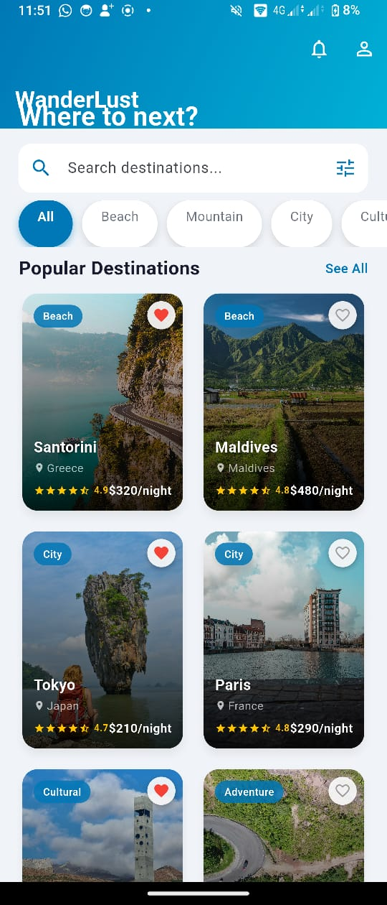
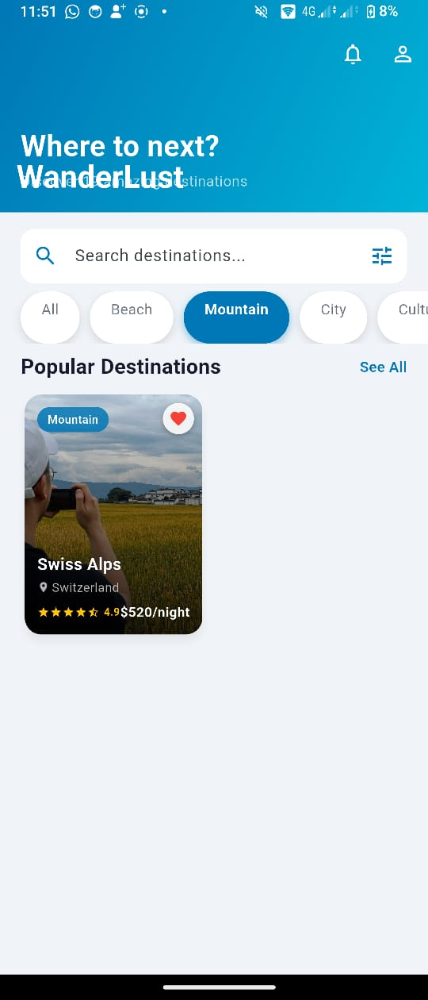
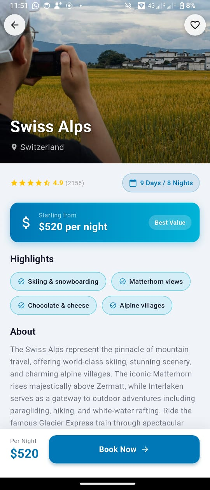
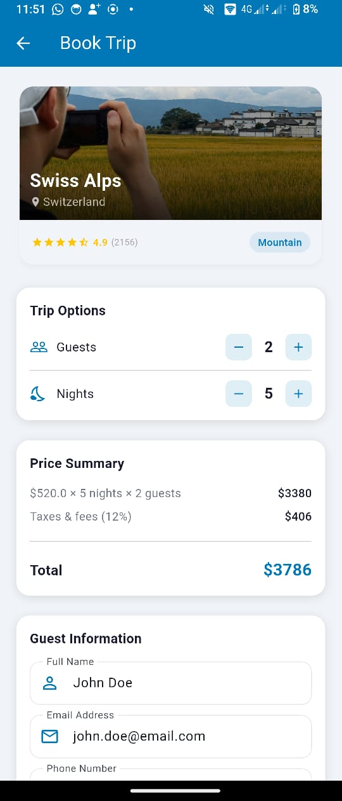
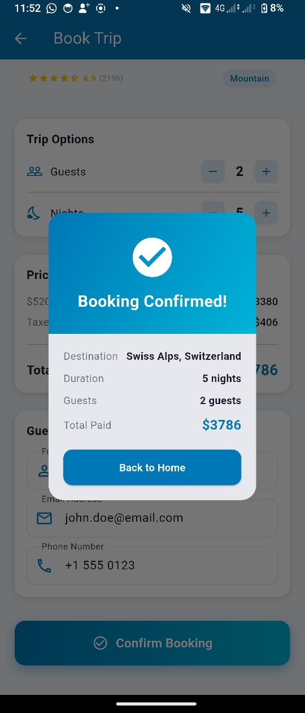

# ✈️ WanderLust — Flutter Multi-Screen Travel App

**Student:** Benjamin TUYISENGE — `223016911`
**Institution:** University of Rwanda — College of Science and Technology (CST)
**Year / Program:** Year 3 — Computer Engineering
**Module:** Mobile Application Systems and Design
**Submission Date:** 4th March 2026
**Framework:** Flutter (Dart) — All data hard-coded, no API or database

---

## 📽️ Implementation Video

> **File:** [`screenshoot_and_video/implementation_video_assignment.mp4`](screenshoot_and_video/implementation_video_assignment.mp4)

The video demonstrates the full live navigation flow:
**Home Screen → Detail Screen → Booking Screen → Confirmation Dialog → Back to Home**

---

## 📱 Screenshots

### 1. Home Screen — All Destinations



- Collapsible `SliverAppBar` with **WanderLust** branding and tagline
- Reactive search `TextField` filtering destinations by name or country
- Horizontal animated category chip filter (All / Beach / Mountain / City / Cultural / Adventure)
- 2-column `SliverGrid` of `DestinationCard` widgets showing image, overlay gradient, favourite toggle, rating, and price

---

### 2. Home Screen — Category Filter Active (Mountain)



- Tapping **Mountain** highlights the chip with an `AnimatedContainer` (200 ms transition)
- Grid reactively filters to show only matching destinations (Swiss Alps)
- Empty-state widget shown if no destinations match

---

### 3. Detail Screen



- Full-width **320 px hero image** with `LinearGradient` overlay
- Floating back + favourite `CircleButton` widgets overlaid via `Stack`
- `RatingWidget` (custom) with half-star support and review count
- Gradient `_PriceCard` showing "Starting from $X per night"
- `Wrap` of `_HighlightChip` widgets (4 highlights per destination)
- Scrollable `About` paragraph with full destination description
- Persistent `bottomNavigationBar` with price + **Book Now** `ElevatedButton`

---

### 4. Booking Screen



- `_BookingSummaryCard` — destination thumbnail, name, country, rating, category chip
- `_TripOptions` — guest and night counter rows with `_CounterButton` increment/decrement
- `_PriceSummary` — live recalculated subtotal, 12% tax, and grand total
- `_GuestInfoForm` — three validated `TextFormField`s (Full Name, Email, Phone)
- Gradient **Confirm Booking** button (`DecoratedBox` + `ElevatedButton`)

---

### 5. Booking Confirmed — Success Dialog



- `AlertDialog` with a gradient header and white check icon
- Booking summary: Destination, Duration, Guests, Total Paid
- **Back to Home** button calls `Navigator.pop()` three times to return directly to Home Screen

---

## 🗂️ Project Structure

```
travel_app/
├── lib/
│   ├── main.dart                        # App entry point
│   ├── theme/
│   │   └── app_theme.dart               # Centralised colour palette & ThemeData
│   ├── models/
│   │   └── destination.dart             # Destination data model
│   ├── data/
│   │   └── travel_data.dart             # 19 hard-coded destinations + categories
│   ├── screens/
│   │   ├── home_screen.dart             # Home — SliverAppBar, search, grid
│   │   ├── detail_screen.dart           # Detail — hero image, info, Book Now
│   │   └── booking_screen.dart          # Booking — form, price calc, dialog
│   └── widgets/
│       ├── destination_card.dart        # Reusable card widget
│       ├── rating_widget.dart           # Star rating display
│       ├── section_header.dart          # Titled row with optional action
│       └── info_chip.dart              # Icon + label badge chip
├── asset/                               # 19 local Unsplash JPEG images
└── screenshoot_and_video/
    ├── home_screen.jpeg
    ├── filtered_home_screen.jpeg
    ├── detail_screen.jpeg
    ├── booking_screen.jpeg
    ├── comformation_popup.jpeg
    ├── implementation_video_assignment.mp4
    └── WanderLust_Lab_Report_Benjamin_Tuyisenge.pdf
```

---

## 🧭 Navigation Flow

```
┌─────────────────────────────────────────────────────────────┐
│                       HOME SCREEN                           │
│  SliverGrid → tap DestinationCard                           │
└────────────────────────┬────────────────────────────────────┘
                         │  Navigator.push(DetailScreen)
                         ▼
┌─────────────────────────────────────────────────────────────┐
│                      DETAIL SCREEN                          │
│  Review destination → tap "Book Now" button                 │
└────────────────────────┬────────────────────────────────────┘
                         │  Navigator.push(BookingScreen)
                         ▼
┌─────────────────────────────────────────────────────────────┐
│                     BOOKING SCREEN                          │
│  Adjust options → fill form → tap "Confirm Booking"         │
└────────────────────────┬────────────────────────────────────┘
                         │  Form validates → showDialog
                         ▼
┌─────────────────────────────────────────────────────────────┐
│                    SUCCESS DIALOG                           │
│  Tap "Back to Home" → Navigator.pop() × 3                  │
└────────────────────────┬────────────────────────────────────┘
                         │
                         ▼
                    HOME SCREEN
```

**Data is passed between screens via constructor parameters** — no shared state manager required.

```dart
// Home → Detail
Navigator.push(context, MaterialPageRoute(
  builder: (_) => DetailScreen(destination: destination),
));

// Detail → Booking
Navigator.push(context, MaterialPageRoute(
  builder: (_) => BookingScreen(destination: dest),
));

// Dialog → Home (pop all 3 routes)
Navigator.of(context).pop(); // close dialog
Navigator.of(context).pop(); // back to detail
Navigator.of(context).pop(); // back to home
```

---

## 🧩 Widgets Used (35 distinct widgets)

| # | Widget | Where Used |
|---|--------|------------|
| 1 | `MaterialApp` | `main.dart` — root widget with theme |
| 2 | `Scaffold` | All three screens |
| 3 | `SliverAppBar` | Home Screen collapsible header |
| 4 | `FlexibleSpaceBar` | Hero banner inside SliverAppBar |
| 5 | `CustomScrollView` | Home Screen sliver container |
| 6 | `SliverGrid` | 2-column destination grid |
| 7 | `SliverChildBuilderDelegate` | Lazy grid builder |
| 8 | `SliverToBoxAdapter` | Search bar + category row in sliver |
| 9 | `ListView` (builder) | Horizontal category filter |
| 10 | `Card` | Destination cards, booking panels |
| 11 | `Stack` | Image + overlay layers |
| 12 | `Positioned` / `Positioned.fill` | Overlay buttons, gradient, text |
| 13 | `Container` | Styled boxes with decoration |
| 14 | `DecoratedBox` | Gradient on Confirm Booking button |
| 15 | `Row` | Horizontal layouts throughout |
| 16 | `Column` | Vertical layouts throughout |
| 17 | `Wrap` | Highlight chips on Detail Screen |
| 18 | `SingleChildScrollView` | Booking Screen scrollable body |
| 19 | `Text` | All text display |
| 20 | `Icon` | Material icons throughout |
| 21 | `IconButton` | Notifications, profile, clear search |
| 22 | `Image.asset` | Local asset photos |
| 23 | `TextField` | Search bar |
| 24 | `TextFormField` | Guest info form fields |
| 25 | `Form` | Form validation group |
| 26 | `GestureDetector` | Category chips, favourite toggle |
| 27 | `AnimatedContainer` | Animated category chip selection |
| 28 | `ElevatedButton` | Book Now, Confirm, Back to Home |
| 29 | `AlertDialog` | Booking success dialog |
| 30 | `Divider` | Price summary separator |
| 31 | `SizedBox` | Spacing throughout |
| 32 | `Padding` | Content padding wrapper |
| 33 | `ClipRRect` | Rounded image corners via Card |
| 34 | `SafeArea` | Avoids status bar on Detail Screen |
| 35 | `LinearGradient` | Hero image + button + price card |

---

## 🎨 Colour Theme

| Role | Colour | Hex |
|------|--------|-----|
| Primary | Deep Ocean Blue | `#0077B6` |
| Secondary | Bright Cyan | `#00B4D8` |
| Accent | Light Blue | `#90E0EF` |
| Text Dark | Navy | `#1A1A2E` |
| Text Grey | Slate | `#6B7280` |
| Star Rating | Gold | `#FFC300` |
| Scaffold BG | Cool Grey | `#F0F4F8` |

---

## 📦 Hard-Coded Data

All data is defined in `lib/data/travel_data.dart` as Dart `const` values.

- **19 destinations** across 5 categories (Beach, Mountain, City, Cultural, Adventure)
- **19 local asset images** (all Unsplash JPEG photographs)
- Price range: **$120 – $560 / night**
- Rating range: **4.6 – 4.9 ★**
- Each destination has: `name`, `country`, `category`, `description`, `imagePath`, `rating`, `reviewCount`, `pricePerNight`, `highlights`, `duration`, `isFavorite`

---

## 📄 Lab Report

Full PDF report with annotated screenshots, widget inventory, layout explanations, and navigation diagram:

> [`screenshoot_and_video/WanderLust_Lab_Report_Benjamin_Tuyisenge.pdf`](screenshoot_and_video/WanderLust_Lab_Report_Benjamin_Tuyisenge.pdf)

---

*Benjamin TUYISENGE | 223016911 | University of Rwanda — CST | March 2026*
